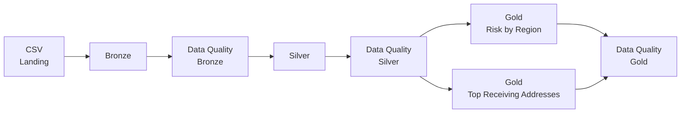

# Fraud Credit Data Pipeline

Pipeline de Engenharia de Dados desenvolvido para ingestão, tratamento, validação e análise de transações financeiras, utilizando **Arquitetura Medalhão**, **Data Quality**, **Docker** e **Apache Airflow**.

---

## Objetivo

O projeto recebe um arquivo CSV contendo dados de transações financeiras e executa um pipeline completo de dados, contemplando:

- ingestão dos dados brutos;
- validações de qualidade dos dados;
- limpeza e padronização;
- transformação dos dados;
- geração de datasets analíticos;
- testes automatizados;
- orquestração com Apache Airflow;
- execução containerizada com Docker.

---

## Arquitetura

O projeto utiliza a **Arquitetura Medalhão**, separando o processamento dos dados nas camadas **Bronze**, **Silver** e **Gold**.



O fluxo completo é:

```text
Landing
   ↓
Bronze
   ↓
Data Quality Bronze
   ↓
Silver
   ↓
Data Quality Silver
   ↓
   ├── Gold - Risk by Region
   │
   └── Gold - Top Receiving Addresses
                 ↓
          Data Quality Gold
```

---

## Camada Bronze

A camada **Bronze** é responsável pela ingestão e preservação dos dados recebidos, mantendo os campos da origem com o mínimo possível de transformação.

O arquivo de entrada é:

```text
data/landing/df_fraud_credit.csv
```

O resultado é armazenado em formato Parquet:

```text
data/bronze/fraud_credit.parquet
```

---

## Camada Silver

A camada **Silver** é responsável pela limpeza, tipagem e padronização dos dados.

Entre os tratamentos realizados estão:

- conversão de `amount` para tipo numérico;
- conversão de `risk_score` para tipo numérico;
- conversão de Unix timestamp para datetime UTC;
- padronização de campos textuais;
- normalização de `transaction_type`;
- identificação e tratamento de regiões inválidas;
- tratamento de valores inválidos como `none`;
- remoção de registros duplicados.

O resultado é armazenado em:

```text
data/silver/fraud_credit.parquet
```

Valores inválidos não são convertidos automaticamente para zero, evitando alterações indevidas nos resultados analíticos.

---

## Camada Gold

A camada **Gold** contém os datasets preparados para consumo analítico.

Foram desenvolvidas duas saídas.

### Risk by Region

Calcula a média de `risk_score` por `location_region`.

O resultado é ordenado pela média de risco de forma decrescente.

Saída:

```text
data/gold/risk_by_region.parquet
```

### Top Receiving Addresses

Para este resultado são consideradas somente transações com:

```text
transaction_type = sale
```

Para cada `receiving_address`, é selecionada a transação de venda mais recente.

Após essa seleção, os registros são ordenados pelo `amount` e são retornados os **3 receiving addresses com os maiores valores**.

Saída:

```text
data/gold/top_receiving_addresses.parquet
```

---

## ✅ Data Quality

O projeto implementa validações automáticas de qualidade nas camadas **Bronze**, **Silver** e **Gold**.

Os relatórios são armazenados em:

```text
reports/
├── bronze/
│   └── data_quality.json
├── silver/
│   └── data_quality.json
└── gold/
    └── data_quality.json
```

### Data Quality - Bronze

Entre as verificações realizadas estão:

- quantidade total de registros;
- schema esperado;
- colunas ausentes;
- colunas inesperadas;
- registros duplicados;
- valores inválidos em `amount`;
- valores inválidos em `risk_score`;
- regiões inválidas;
- timestamps inválidos;
- `receiving_address` ausente;
- `transaction_type` ausente.

Também são calculados os indicadores:

```text
error_rate_percentage
conformity_percentage
```

O percentual de erro considera os registros que apresentam pelo menos uma inconsistência.

Isso evita contar duas vezes o mesmo registro quando ele possui mais de um problema de qualidade.

### Data Quality - Silver

Na camada Silver são verificadas condições como:

- tipos de dados;
- registros duplicados;
- valores nulos;
- regiões inválidas;
- conversão correta de campos numéricos;
- conversão correta do timestamp;
- permanência de valores textuais inválidos em campos numéricos.

Validações consideradas críticas interrompem o pipeline quando não são atendidas.

### Data Quality - Gold

Na camada Gold são verificadas regras relacionadas aos resultados analíticos.

Entre elas:

- estrutura esperada das tabelas;
- ausência de valores nulos;
- tipos de dados esperados;
- ordenação correta;
- unicidade das regiões;
- quantidade esperada de registros no Top 3;
- unicidade de `receiving_address`;
- validação da venda mais recente por endereço.

---

## Orquestração com Apache Airflow

A execução do pipeline é orquestrada utilizando **Apache Airflow**.

A DAG criada é:

```text
fraud_credit_medallion
```

O fluxo da DAG é:

```text
        bronze_ingestion
                ↓
        bronze_quality
                ↓
        silver_transformation
                ↓
           silver_quality
       ↙                  ↘
gold_risk_by_region     gold_top_receiving_addresses
       ↘                 ↙
           gold_quality
```

As duas transformações da camada Gold são independentes e podem executar em paralelo após a conclusão e validação da camada Silver.

A DAG está configurada com:

```python
schedule=None
```

Isso ocorre porque o desafio não especifica uma janela para o agendamento.

Em um cenário produtivo, o agendamento poderia ser configurado de acordo com a frequência de disponibilização dos dados, apenas alterando o campo `schedule`.

---

## Estrutura do Projeto

```text
fraud-credit-data-pipeline/
│
├── dags/
│   └── fraud_credit_medallion.py
│
├── data/
│   ├── landing/
│   ├── bronze/
│   ├── silver/
│   └── gold/
│
├── reports/
│   ├── bronze/
│   ├── silver/
│   └── gold/
│
├── src/
│   ├── common/
│   │   ├── __init__.py
│   │   ├── logger.py
│   │   └── paths.py
│   │
│   ├── bronze/
│   │   ├── __init__.py
│   │   ├── ingestion.py
│   │   └── quality.py
│   │
│   ├── silver/
│   │   ├── __init__.py
│   │   ├── transformation.py
│   │   └── quality.py
│   │
│   ├── gold/
│   │   ├── __init__.py
│   │   ├── risk_by_region.py
│   │   ├── top_receiving_addresses.py
│   │   └── quality.py
│   │
│   └── pipeline.py
│
├── tests/
│   └── test_gold.py
│
├── Dockerfile
├── Dockerfile.airflow
├── docker-compose.yml
├── pytest.ini
├── requirements.txt
├── requirements-airflow.txt
├── .dockerignore
├── .gitignore
└── README.md
```

---

## Tecnologias Utilizadas

- Python
- Pandas
- PyArrow
- Apache Parquet
- Apache Airflow
- PostgreSQL
- Docker
- Docker Compose
- Pytest
- Git
- GitHub

---

## Pré-requisitos

Para executar o projeto utilizando containers é necessário possuir:

- Docker
- Docker Compose
- Git

O Python instalado localmente é opcional quando a execução é realizada completamente via Docker.

---

## Arquivo de Entrada

O CSV utilizado pelo pipeline não é armazenado no repositório devido ao seu tamanho e para evitar o versionamento de dados brutos.

O arquivo deve ser colocado em:

```text
data/landing/df_fraud_credit.csv
```

A estrutura esperada possui as seguintes colunas:

```text
timestamp
sending_address
receiving_address
amount
transaction_type
location_region
ip_prefix
login_frequency
session_duration
purchase_pattern
age_group
risk_score
anomaly
```

---

## Executando o Pipeline com Docker

### 1. Clone o repositório

```bash
git clone git@github.com:Sara-Mirian-Santos/Desafio_Localiza.git
```

Entre na pasta:

```bash
cd fraud-credit-data-pipeline
```

### 2. Adicione o arquivo de entrada

Coloque o arquivo:

```text
df_fraud_credit.csv
```

em:

```text
data/landing/
```

A estrutura deve ficar:

```text
data/landing/df_fraud_credit.csv
```

### 3. Construa as imagens

```bash
docker compose build
```

### 4. Execute o pipeline

```bash
docker compose run --rm pipeline
```

A execução realizará:

```text
Landing
   ↓
Bronze
   ↓
Data Quality Bronze
   ↓
Silver
   ↓
Data Quality Silver
   ↓
Gold
   ↓
Data Quality Gold
```

Os arquivos resultantes serão disponibilizados nas pastas:

```text
data/bronze/
data/silver/
data/gold/
reports/
```

---

## Executando os Testes

Com um ambiente Python configurado, execute:

```bash
pytest -v
```

Os testes automatizados validam principalmente as regras de negócio da camada Gold.

Entre os cenários testados estão:

- ordenação decrescente do risco médio;
- tratamento de valores nulos;
- utilização da venda mais recente;
- aplicação do filtro de `transaction_type`;
- comportamento quando a venda mais recente possui `amount` inválido;
- retorno de apenas três `receiving_address`.

---

## Executando com Apache Airflow

### 1. Configure o UID do Airflow

Em ambientes Linux/WSL, crie um arquivo `.env` na raiz do projeto.

Descubra o UID do usuário:

```bash
id -u
```

Adicione o resultado ao `.env`:

```env
AIRFLOW_UID=1000
```

> O valor `1000` é apenas um exemplo. Utilize o UID retornado pelo comando `id -u`.

### 2. Inicialize o Airflow

Execute:

```bash
docker compose run --rm airflow-init
```

Esse processo realiza a migração do banco de metadados e cria o usuário administrativo local.

### 3. Inicie os serviços

```bash
docker compose up -d postgres airflow-webserver airflow-scheduler
```

Verifique o estado dos containers:

```bash
docker compose ps
```

### 4. Acesse o Airflow

A interface estará disponível em:

```text
http://localhost:8080
```

Credenciais para o ambiente local:

```text
Usuário: admin
Senha: admin
```

> Essas credenciais são utilizadas exclusivamente para execução local do desafio.

### 5. Execute a DAG

Na interface do Airflow:

1. localize a DAG `fraud_credit_medallion`;
2. habilite a DAG;
3. selecione `Trigger DAG`;
4. acompanhe a execução pela visualização **Graph**.

Uma execução bem-sucedida deverá finalizar todas as tasks com status `success`.

---

## Decisões Técnicas

### Arquitetura Medalhão

A separação em **Bronze**, **Silver** e **Gold** permite separar as responsabilidades de ingestão, tratamento e consumo analítico.

Também facilita rastreabilidade, manutenção e aplicação de regras de qualidade em diferentes momentos do processamento.

### Apache Parquet

As camadas processadas são persistidas utilizando **Apache Parquet**.

O formato foi escolhido por ser colunar, eficiente para armazenamento e adequado para workloads analíticos.

### Pandas

O Pandas foi utilizado para processamento e transformação dos dados por atender adequadamente ao volume fornecido no desafio e permitir uma solução simples e reproduzível.

Em cenários com volumes significativamente maiores, poderia ser considerada uma tecnologia de processamento distribuído, como Apache Spark.

### Airflow e XCom

Os DataFrames não são transferidos entre as tasks utilizando XCom.

Cada etapa persiste seu resultado em Parquet e a próxima etapa realiza a leitura do arquivo necessário.

Essa decisão evita transferir grandes volumes de dados através do banco de metadados do Airflow.

### PostgreSQL

O PostgreSQL é utilizado exclusivamente como banco de metadados do Apache Airflow.

Os dados processados pelo pipeline permanecem armazenados em arquivos Parquet.

### LocalExecutor

O Airflow utiliza `LocalExecutor`, adequado para a execução local deste desafio.

Em um ambiente produtivo e distribuído, a estratégia de execução poderia ser alterada de acordo com os requisitos de escalabilidade da plataforma.

---

## Regras e Premissas

### Valores numéricos inválidos

Valores textuais inválidos, como:

```text
none
```

encontrados em campos numéricos são convertidos para valores nulos durante o tratamento da camada Silver.

Eles não são transformados em zero, pois isso poderia alterar médias, ordenações e demais resultados analíticos.

### Região inválida

O valor:

```text
0
```

encontrado em `location_region` foi considerado inconsistente por não representar uma região válida dentro do domínio observado no dataset.

Na camada Silver, esse valor é tratado como ausente.

### Última venda por Receiving Address

Para o cálculo dos três maiores `receiving_address`, a seguinte ordem é respeitada:

1. são filtradas somente transações com `transaction_type = sale`;
2. registros sem `receiving_address` ou timestamp válido não participam da seleção;
3. é selecionada a venda mais recente de cada `receiving_address`;
4. após determinar a venda mais recente, registros sem `amount` válido são excluídos do ranking;
5. os registros restantes são ordenados por `amount`;
6. são retornados os três maiores valores.

A validação do `amount` ocorre **depois** da seleção da venda mais recente.

Dessa forma, caso a venda mais recente possua um `amount` inválido, o pipeline não utiliza incorretamente uma venda mais antiga daquele endereço.

### Empate de Timestamp

O dataset não possui um identificador único de transação documentado.

Em um eventual empate de timestamp para o mesmo `receiving_address`, é utilizado um critério determinístico baseado na ordem dos registros.

Em um ambiente produtivo, seria recomendado utilizar um identificador único da transação como critério adicional de desempate.

### Empate de Amount

Em caso de empate de `amount` durante a geração do Top 3, `receiving_address` é utilizado como critério secundário para manter o resultado determinístico.

---

## Segurança e Versionamento

O arquivo CSV original não é versionado no Git, devido ao tamanho exceder o suportado pelo GitHub.

O `.gitignore` contém uma regra para impedir seu versionamento:

```gitignore
data/landing/*.csv
```

---

Projeto desenvolvido como desafio técnico de Engenharia de Dados.